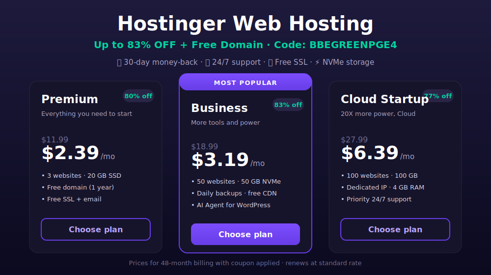

# Hostinger Promo Code June 2026 ✅ Up to 83% OFF + Free Domain (Verified Coupon)

[](https://www.hostinger.com/pk?REFERRALCODE=BBEGREENPGE4)

> 👉 **[Claim Your Hostinger Discount — Up to 83% Off + Free Domain](https://www.hostinger.com/pk?REFERRALCODE=BBEGREENPGE4)**

**Copy your coupon code** (click the icon on the right to copy 👇):

```
BBEGREENPGE4
```

The code applies automatically through the link above — no manual typing needed.

A **Hostinger promo code** is a discount link or code that lowers the price of Hostinger web hosting, Website Builder, and VPS hosting plans at checkout. The verified referral link above applies an extra **20% off** on top of existing plan discounts, adds a **free domain**, includes a **free SSL certificate**, and keeps a **30-day money-back guarantee**.

This page collects verified Hostinger coupon codes and promo codes for June 2026. The savings stack on top of Hostinger's existing plan discounts. The main benefits are a lower upfront cost, a free domain for the first year, a free SSL certificate, and a 30-day money-back guarantee. The main uses cover web hosting, WordPress hosting, Cloud hosting, VPS hosting, Website Builder, and business email.

---

## Special Discounts for Hosting and Website Builder Plans

### Hosting
Hostinger web hosting is secure and fast. Every web hosting plan includes a free SSL certificate, NVMe storage, and the hPanel control panel.

### Website Builder
Hostinger Website Builder creates a site or online store in 3 steps. Add a site description, let the AI build it, then adjust the finishing touches with the drag-and-drop editor.

### VPS Hosting
Hostinger VPS hosting gives more power and control for busy projects. Free automatic weekly backups are included, with NVMe SSD storage and full root access.

---

## Pick Your Perfect Plan

There are 3 main web hosting plans at Hostinger, which are Premium, Business, and Cloud Startup. Pricing below reflects the 48-month billing cycle with the coupon applied.

| Plan | Regular | Discounted | You Save |
|------|---------|------------|----------|
| Single Shared Hosting | $3.99/mo | $0.99/mo | **80% Off** |
| Premium Shared Hosting | $11.99/mo | $2.84/mo | **76% Off** |
| Business Hosting | $18.99/mo | $3.79/mo | **79% Off** |
| Cloud Startup | $27.99/mo | $7.59/mo | **73% Off** |
| Cloud Professional | $49.99/mo | $13.99/mo | **72% Off** |

All plans include a free SSL certificate, a free domain for the first year on Premium and above, 24/7 live chat support, a 30-day money-back guarantee, NVMe SSD storage, and the hPanel control panel.

---

## How to Redeem Hostinger Coupons

1. **Choose your plan with the coupon applied.** Click your chosen plan through the [referral link](https://www.hostinger.com/pk?REFERRALCODE=BBEGREENPGE4) and go to the checkout page.
2. **Go through the checkout process.** Fill in the payment details and complete the transaction to reach the members area.
3. **Enjoy your hosting plan.** Choose your website creation tool or migrate an existing site with no downtime.

---

## Top Hostinger Coupon Codes: 79% Off Hosting & Free Domains

- **79% Off Hostinger Coupon Code for First-Time Users** ✅ — Save 79% on web hosting plans from $2.99/mo, with a free domain and a 30-day money-back guarantee.
- **20% Off Hostinger Single Hosting Coupon** ✅ — From $4.99/mo to ~$3.99/mo on 48 months. Includes 1 website, 10 GB SSD storage, free SSL, weekly backups, and free business email for the first year.
- **Hostinger Premium Hosting Coupon (75% Off + 2 Months Free)** ✅ — ~$1.86/mo instead of $7.19/mo. Up to 3 websites, 20 GB SSD storage, free domain, managed WordPress updates, drag-and-drop builder, and free SSL.
- **Hostinger Business Hosting Deal (64% Off + 2 Months Free)** ✅ — ~$3.11/mo instead of $8.39/mo. Up to 50 websites, 50 GB NVMe storage, daily backups, AI ecommerce tools, and free CDN.
- **80% Off Hostinger Student Deal 2026 (Premium Hosting + Free Domain)** ✅ — ~$2.49/mo on 48 months, with a free domain, up to 100 websites, and 100 GB SSD storage.
- **Hostinger Cloud Startup Coupon (65% Off + 2 Months Free)** ✅ — ~$7.49/mo instead of $20.39/mo. Up to 100 websites, 100 GB NVMe storage, dedicated IP, priority 24/7 support, and 4 GB RAM.
- **31% Off Hostinger Horizons Explorer Coupon** ✅ — $7.29/mo instead of $10.49/mo, with 30 AI credits per month.
- **Hostinger Horizons Starter Coupon (30% Off)** ✅ — $14.69/mo instead of $20.89/mo, with 70 AI credits monthly and a free domain.
- **Hostinger Horizons Hobbyist Deal (29% Off)** ✅ — ~$41.69/mo instead of $58.39/mo, with 200 AI credits per month.
- **Hostinger Horizons Hustler Coupon (20% Off)** ✅ — ~$83.39/mo instead of $104.49/mo, with 400 AI credits per month.
- **Hostinger Starter Website Builder Coupon (83% Off)** ✅ — $0.86/mo on 48 months, with 1 website, 1 GB storage, and 300+ templates.
- **Hostinger Premium Website Builder Discount (75% Off + 2 Months Free)** ✅ — $1.86/mo instead of $7.19/mo, with a free domain and drag-and-drop builder.
- **Hostinger Business Website Builder Deal (64% Off + 2 Months Free)** ✅ — ~$3.11/mo. Sell up to 1,000 products, 100+ payment methods, zero transaction fees.
- **Hostinger AI Website Builder Coupon (Up to 64% Off)** ✅ — From ~$1.86/mo, with AI layouts, content, images, logos, and SEO.
- **Hostinger VPS KVM 1 Coupon Code (64% Off)** ✅ — $7.19/mo instead of $19.79/mo. 1 vCPU, 4 GB RAM, 50 GB NVMe, 4 TB bandwidth.
- **Hostinger VPS KVM 4 Deal (69% Off)** ✅ — ~$13.19/mo instead of $41.99/mo. 4 vCPU, 16 GB RAM, 200 GB NVMe, 16 TB bandwidth.
- **Hostinger VPS KVM 8 Coupon (65% Off)** ✅ — $26.39/mo instead of $74.39/mo. 8 vCPU, 32 GB RAM, 400 GB NVMe, 32 TB bandwidth.
- **Hostinger n8n VPS KVM 1 Promo Code (64% Off)** ✅ — $7.19/mo. Self-host n8n automation with 1 vCPU, 4 GB RAM.
- **Hostinger n8n VPS KVM 2 Coupon (62% Off)** ✅ — $9.59/mo instead of $25.19/mo. 2 vCPU, 8 GB RAM, 100 GB NVMe.
- **Hostinger n8n VPS KVM 4 Deal (69% Off)** ✅ — $13.19/mo instead of $41.99/mo. 4 vCPU, 16 GB RAM, 200 GB NVMe.
- **Hostinger Starter Business Email Coupon (81% Off)** ✅ — $0.36/mo instead of $1.86/mo. 1 mailbox, 10 GB storage, 1,000 emails/day.
- **Hostinger Premium Business Email Deal (79% Off)** ✅ — $0.79/mo per mailbox, 5 mailboxes for the price of 4, 50 GB storage, free domain.
- **Hostinger AI Business Email Deal (Up to 79% Off)** ✅ — From $0.79/mo with the Kodee AI Mailbox Assistant, smart replies, and summaries.
- **Hostinger Email Marketing Coupon (58% Off)** ✅ — $2.39/mo instead of $5.79/mo. Up to 500 recipients and 3,500 emails monthly.
- **Hostinger AI Email Marketing Deal (58% Off + AI Credits)** ✅ — $2.39/mo with 20 AI credits upfront plus 10 each month.
- **Hostinger Managed OpenClaw Coupon Code (73% Off)** ✅ — $5.99/mo instead of $21.99/mo. Ready-to-use AI agents, OpenClaw CLI, Telegram and WhatsApp pairing. Renews at $11.99/mo.
- **Hostinger OpenClaw on VPS Coupon Code (63% Off)** ✅ — $8.99/mo instead of $24.49/mo. Root access, custom configs, dedicated resources. Renews at $14.99/mo.

> 👉 **[Claim Hostinger 20% Off Coupon](https://www.hostinger.com/pk?REFERRALCODE=BBEGREENPGE4)**

---

## How to Claim Your Hostinger 83% Off Coupon Code

The discount applies automatically without entering any code manually.

1. Open the [special Hostinger signup link](https://www.hostinger.com/pk?REFERRALCODE=BBEGREENPGE4) where the extra 20% discount is already activated.
2. Select a plan such as Single Shared, Premium Shared, Business, WordPress Hosting, or Cloud.
3. Pick a plan for at least 12 months to activate the referral discount; 24 or 48 months give better savings.
4. Review your cart and confirm the reduced price reflects the extra 20% off.
5. Sign up with your email or continue with Google, then set your login details.
6. Choose a payment option such as card, net banking, or PayPal and finish the purchase.
7. Log in to your dashboard, claim your free domain, install WordPress, and get your site live.

---

## What is Hostinger? Is It Worth It in 2026?

Hostinger is one of the largest web hosting companies, serving over 3 million customers across 178 countries. Founded in 2004 and headquartered in Kaunas, Lithuania, Hostinger combines low prices with above-average performance.

Key features that make Hostinger stand out in 2026:

- **LiteSpeed web servers:** faster than Apache or Nginx on comparable hardware.
- **NVMe SSD storage:** up to 10× faster read and write speeds than traditional SSD.
- **hPanel:** a custom control panel, faster and more intuitive than cPanel.
- **AI Website Builder:** launch a professional site in minutes without coding.
- **Free SSL** on all plans, included by default.
- **Free domain** for the first year on Premium, Business, and Cloud plans.
- **24/7 live chat support** with real human agents.
- **99.9% uptime guarantee** backed by a service-level agreement.
- **30-day money-back guarantee** for new users.

---

## Terms & Conditions of Hostinger 20% Off Promo Codes

- **New users only:** the 20% off referral discount is valid for first-time purchases.
- **Eligible plans:** Web Hosting, WordPress Hosting, Cloud Hosting, and VPS Hosting.
- **Minimum period:** a purchase of 12 months or more is required.
- **One coupon per order:** the discount cannot be combined with other active codes.
- **Stacks on plan discounts:** the extra 20% applies on top of existing plan discounts.
- **Domains excluded:** domain-only purchases and premium TLD registrations are not eligible.
- **Money-back policy:** the 30-day guarantee applies to hosting plans, not domain registrations.

---

## FAQs on Hostinger Coupon & Promo Codes

**What is the Hostinger 20% off coupon code for 2026?**
The Hostinger 20% off discount for 2026 is tied to Hostinger's referral program. Instead of a manual coupon code, the extra 20% discount applies automatically when you sign up through a verified referral link.

**Can I use the Hostinger 20% off coupon on all plans?**
The 20% off referral coupon applies to Web Hosting, WordPress Hosting, Cloud Hosting, and VPS Hosting plans for purchases of 12 months or more. Domain-only purchases and premium TLDs are excluded.

**Can I combine the Hostinger 20% coupon with other offers?**
No. Hostinger allows only one coupon code per order. The referral discount already represents the maximum sign-up discount for new users and applies on top of existing plan discounts.

**Does Hostinger offer a free domain with the 20% off coupon?**
Yes. Sign up through the referral link and choose the Premium, Business, or Cloud plan for 12 months or more to receive a free domain name for the first year.

**Is Hostinger legit?**
Yes. Hostinger has provided hosting services for over 20 years and serves millions of customers worldwide, with 24/7 support and a 30-day money-back guarantee.

**Can I migrate my current website for free using Hostinger?**
Yes. Hostinger migrates your site for free with no downtime. Migrations usually process within 24 hours once started.

**Does Hostinger offer a student discount?**
Yes. Students who verify their status through Student Beans can unlock an exclusive student discount on selected plans.

---

## Conclusion: Claim Your Hostinger 20% Off Coupon Code (2026)

The Hostinger 20% off coupon code (2026) gives one of the lowest entry prices to launch a website. Here is what you get with this deal:

- Extra 20% off on eligible hosting plans
- Plans starting around $0.99 per month after discount
- Free domain for the first year
- Free SSL certificate on all plans
- 30-day money-back guarantee
- 24/7 live chat support
- No code needed, since the discount applies automatically

> 👉 **[Claim Now Before It Expires — Hostinger 20% Off](https://www.hostinger.com/pk?REFERRALCODE=BBEGREENPGE4)**

---

*This is an affiliate page. Purchases made through the links may earn a commission at no extra cost to you.*
